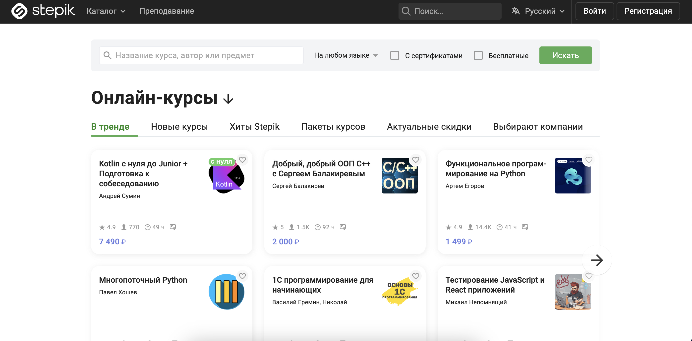

<h1>Автоматизация тестирования UI и API для учебной платформы <a href="https://stepik.org">Stepik</a></h1>


---

### Используемый стек технологий и инструментов


---
## Реализованные автотесты

### UI и API

#### UI

- **Авторизация**
  - ✅ Успешная авторизация в системе и выход из системы
  - ✅ Авторизация с невалидными данными

- **Фильтрация курсов**
  - ✅ Фильтрация курсов "Только с сертификатом"
  - ✅ Фильтрация курсов "Только со скидкой"

- **Поиск**
  - ✅ Проверка успешного поиска на сайте
  - ✅ Проверка неудачного поиска на сайте

#### API

- **Авторизация**
  - ✅ Успешная авторизация в системе
  - ✅ Попытка входа в систему с неверными данными
  - ✅ Выход пользователя из системы

- **Пагинация**
  - ✅ Проверка успешного получения списка курсов
  - ✅ Проверка ответа при запросе несуществующего списка курсов

- **Профиль пользователя**
  - ✅ Проверка получения информации о профиле пользователя
  - ✅ Проверка получения информации о несуществующем профиле пользователя
  - ✅ Проверка обновления информации профиля пользователя


---

### Запуск автотестов

### 💻 Локальный запуск

1. **Склонируйте репозиторий:**
   ```sh
   git clone <git@github.com:lexaeliseev/stepik-ui-api-test-automation.git>
2. **Установите зависимости:**
   ```
   python -m venv .venv
   source .venv/bin/activate
   pip install -r requirements.txt
   ```
3. **Создайте файл .env по образцу в папке проекта:**
   ```python
   URL = "https://stepik.org"
   
   STEPIK_EMAIL = ''
   STEPIK_PASSWORD = ''
   
   SELENOID_URL = 'selenoid.autotests.cloud/wd/hub'
   SELENOID_LOGIN = ''
   SELENOID_PASSWORD = ''
   
   CLIENT_ID = ''
   CLIENT_SECRET = ''
   ```
   
4. **Запустите тесты в PyCharm или в командной строке:**
   ```
   pytest . --browser=[firefox|chrome]
   # Укажите браузер: chrome (по умолчанию) или firefox
   ```
5. **Для генерации отчета о прохождении тестов выполните команду:**
   ```sh
   allure serve .\allure-results


###  Запуск проекта в [Jenkins](https://jenkins.autotests.cloud/job/C16-lexaeliseev-final/)

